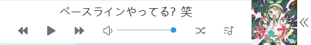

# 使用说明



点击封面可进入全屏模式


- css引入

```cs
<link rel="stylesheet" href="./zymPlayer.css" />
```

- javascript引入

```javascript
<script src="./amplitude.min.js"></script>
<script src="./zymPlayer.js"></script>
<script>
    // 初始化播放器
    new zymAplayer({
        width: '450px',
        mode: 'random',
        list: {
            path: '/music/musicList.json',
        },
        position: {
            left: '0px',
            bottom: '0px'
        }
    });
</script>
```

- 参数配置

```javascript
new zymAplayer({
    element: 'body',  // 播放器容器元素（可选，默认body）
    width: '450px',  // 播放器长度（可选，默认300px）
    mode: 'random',  // 歌曲播放顺序（可选，order：顺序（默认） list：循环  song：单曲循环  random：随机）
    show: 'all',  // 显示方式（可选，all：全部显示（默认） cover：只显示封面  none：隐藏）
    list: {
        path: '/music/musicList.json', // 歌单json地址
        height: 320, // 歌单高度（可选，默认320，单位px）
        expand: false // 歌单是否默认展开（可选，true：是  false：否（默认））
    },
    position: {
        pos: 'fixed', // 相对于容器元素定位方式（可选，默认fixed）
        // left right参数至少选其一
        left: '0px',  // 相对于容器元素定位左距离
        // right: '0px',  // 相对于容器元素定位右距离
        // top bottom参数至少选其一
        top: '0px'  // 相对于容器元素定位上距离
        // bottom: '0px'  // 相对于容器元素定位下距离
});
```

- 歌单JSON配置

```json
[
    {
        "name": "ベースラインやってる？笑",  //  歌曲名称
        "artist": "ななひら",       //  歌曲作者
        "url": "/music/song/ななひら - ベースラインやってる？笑.mp3",  //  歌曲地址，可使用外网地址（http、https）
        "cover_art_url": "/music/img/ベースラインやってる？笑.jpg"     //  歌曲图片，可使用外网地址（http、https）
    },
    {
        "name": "Reality",
        "artist": "Lost Frequencies / Janieck",
        "url": "/music/song/Lost Frequencies; Janieck - Reality.mp3",
        "cover_art_url": "/music/img/Reality.jpg"
    }
]
```